# Part 1. Запуск нескольких docker-контейнеров с использованием docker compose

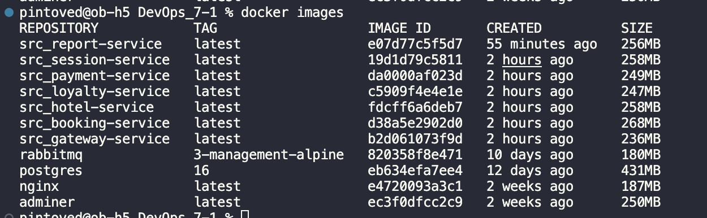
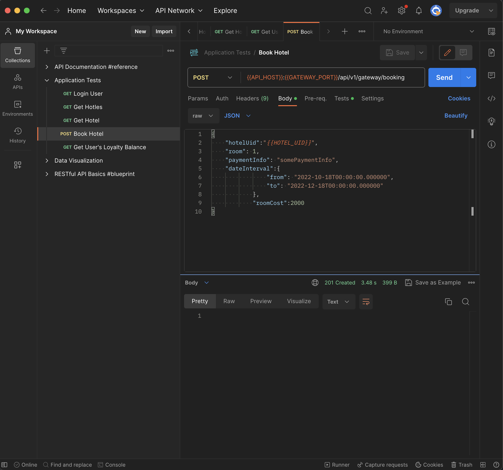
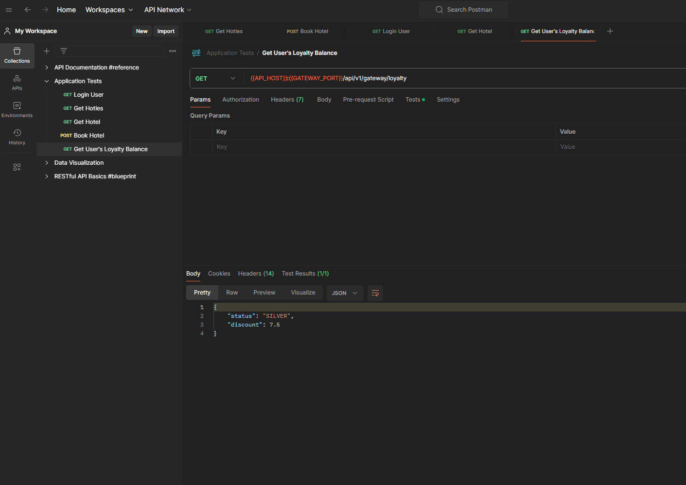
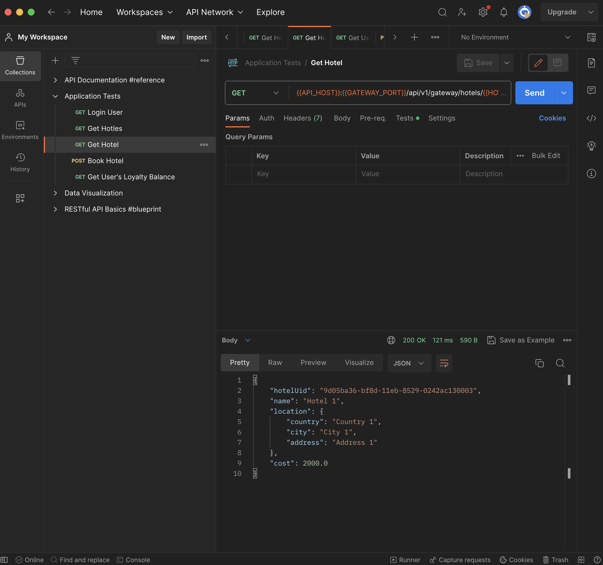
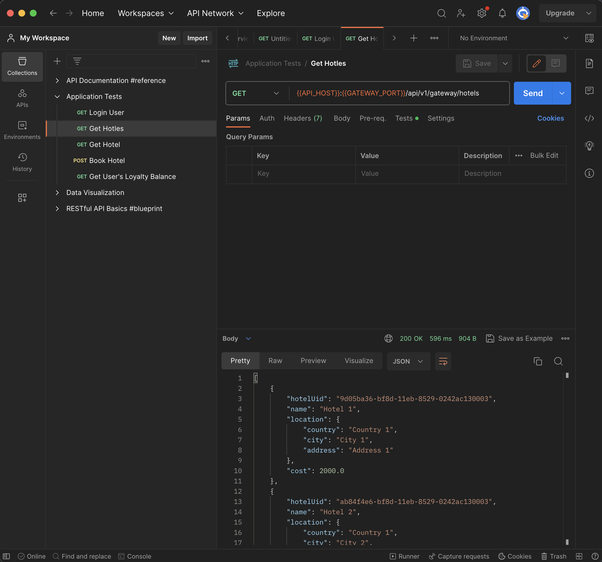
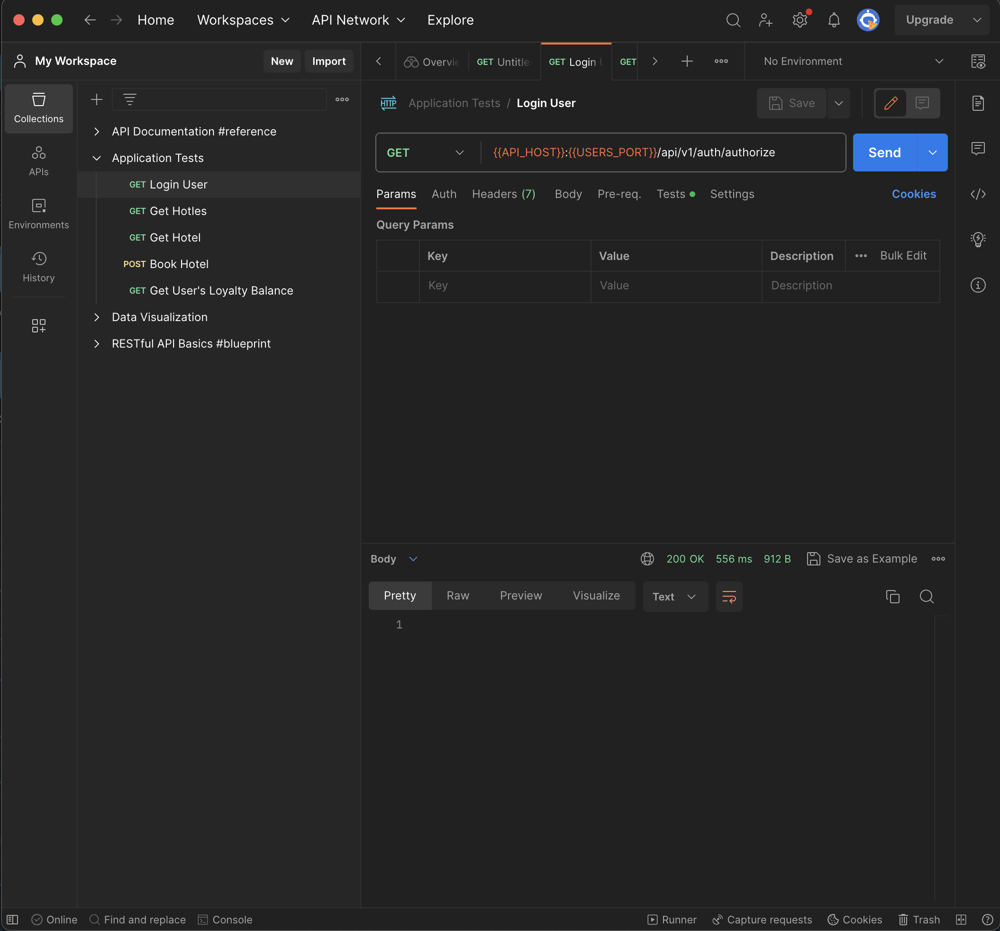

## Part 2. Создание виртуальных машин

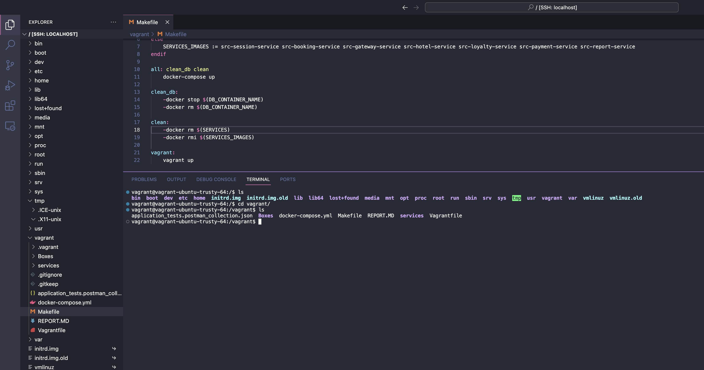

## Part 3. Создание простейшего docker swarm

1) Модифицировать Vagrantfile для создания трех машин: manager01, worker01, worker02. Написать shell-скрипты для установки docker внутрь машин, инициализации и подключения к docker swarm. Помощь с docker swarm материалах.
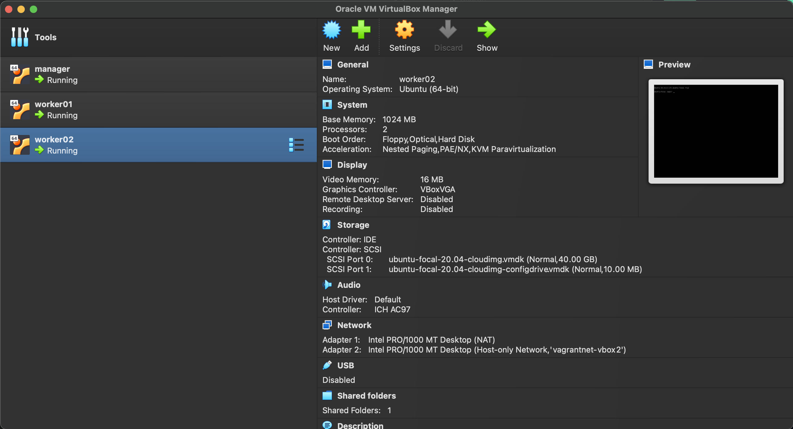
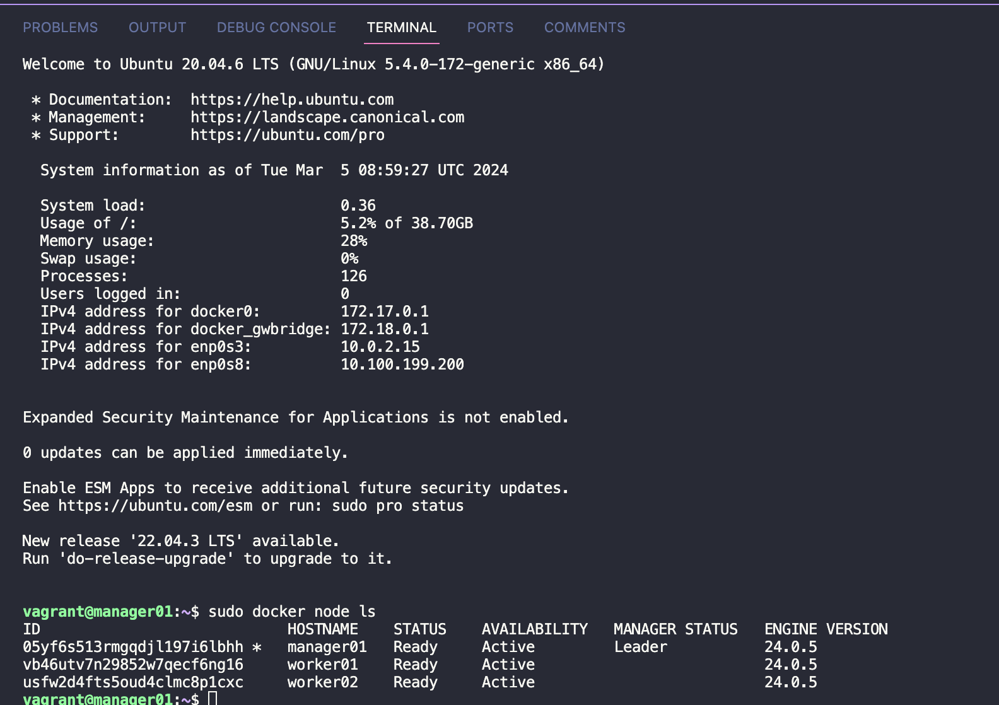
2) Загрузить собранные образы на docker hub и модифицировать docker-compose файл для подгрузки расположенных на docker hub образов.
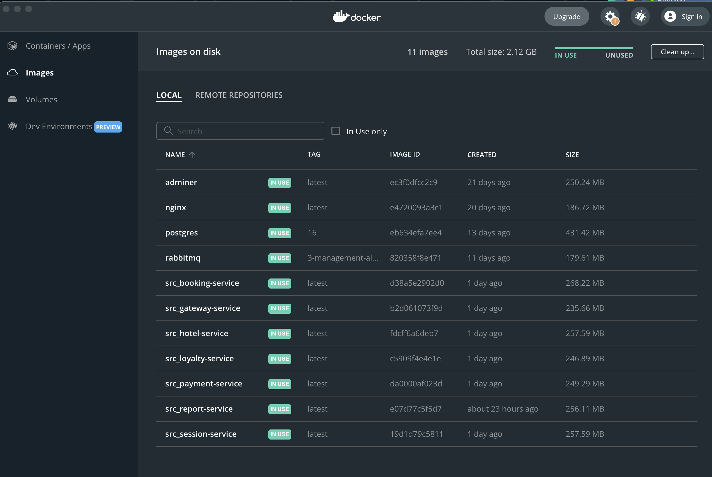
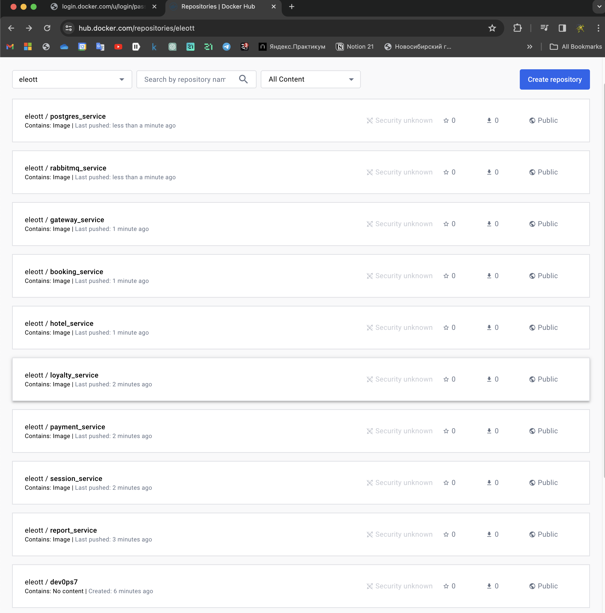

